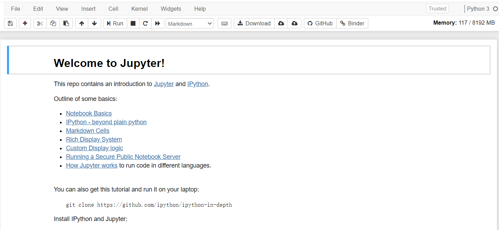
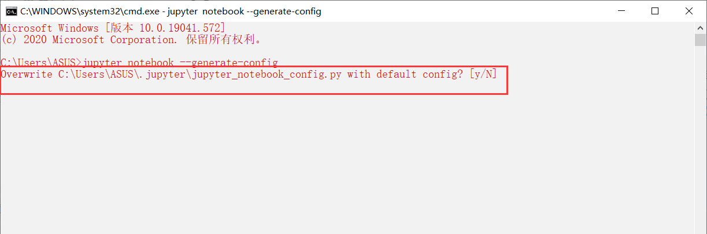
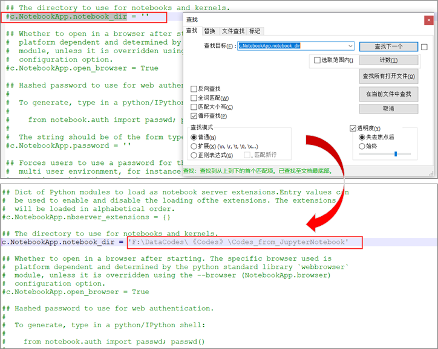
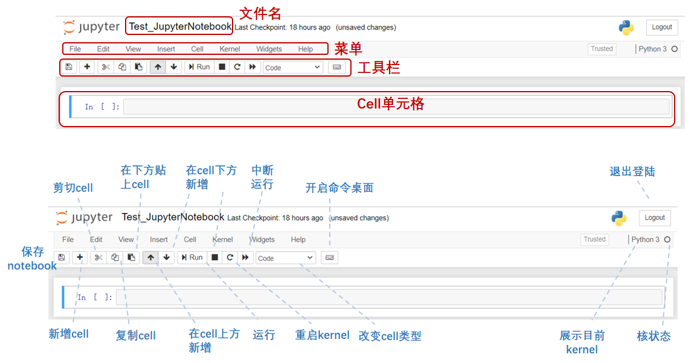
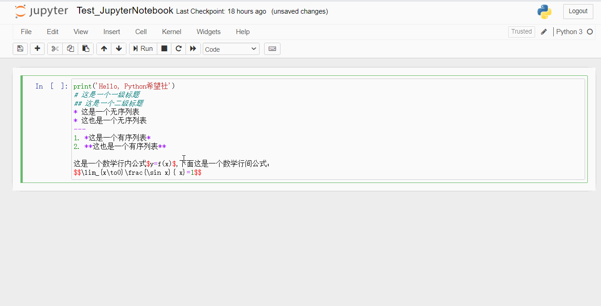

#### Jupyter Notebook安装及使用

---

Jupyter是从IPython发展演变而来的，随着逐渐发展，现已支持运行包括Python、R、Julia、Java、C#、Ruby、Javascript等40余种语言。而**Jupyter**这个名字也主要来源于**Julia**、**Python**和**R**

Jupyter Notebook（曾被称为：IPython notebook），可以将其简单理解为由**IPython 和 Notebook**组成的一个集成架构，是一个介于IDE(Pycharm, Spider等)以及Editor(Sublime text, Atom, VScode, txt记事本)之间的交互式笔记本或web应用程序。

Jupyter Notebook在资料读取与处理、数值模拟、统计建模和机器学习等领域发挥着重要作用，他的一些主要特点和优势包括但不仅限于如下所示：

* 颜值高！
* 文学编程： 集编程和写作于一体
* 支持多种语言：除上面列举的以外，还包括Fortran、Matlab、Mathematica等经典科学计算语言。[点击这里你可以查看jupyter notebook支持的所有语言](https://github.com/jupyter/jupyter/wiki/Jupyter-kernels)
* 分享便捷：可以使用电子邮件、Dropbox、GitHub和Jupyter Notebook Viewer与他人共享。
* 交互式输出：不仅可以生成HTML、图片、视频和$\LaTeX$数学公式，还能输出互动的可视化内容：比如可调参数的数学方程、地图和三维立体模型等。

本文大纲如下，全文约1500字，阅读用时约 2 Mins。文末附有惊喜噢！


#### 〇、先白嫖试用一番，再决定是否安装

如果你还没有考虑好是否安装jupyter notebook，你可以按照下面的提示在官网网站先白嫖测试一番，再来做决定也不迟。

1. [点击这里进入官网](https://jupyter.org/try)，选择带有python图案的 `Try Classic Notebook`
2. 之后只要耐心等待加载结束后，我们就可以看到下面的界面表示你已进入在线平台



进入`welcome to jupyter`界面，点击`file`新建`python 3`文件，现在你就可以开始编写你的代码或文档了

#### 一、Jupyter Notebook的安装

在安装jupyter notebook之前，你需要先在电脑上安装python，python2.7 或python3.3乃至更高版本都可以。在这里小编为大家整理了下面两种方法安装：

**第一种安装方法：Anaconda**

​	对于不熟悉的同学或刚入门的同学强烈安利[直接点击这里]()进入官网下载最新的Anaconda发行版来同时安装python和jupyter  notebook。

> Anaconda 不仅包含了这俩工具，还包含了大量机器学习中常用的包库。在终端运行如下命令即可查看：
>
> ```
> conda list
> ```

**第二种安装方法：pip命令安装**

​		如果你对python已经具有了一定了解，那么你也可以通过选择pip命令进行安装。主要有以下两个步骤：

* 首先将你的pip升级到最新版本
  老版本的pip在安装jupyter Notebook过程中面临依赖项无法同步安装的问题。因此强烈建议先将pip升级到最新版本。

```
# Python 3.x 
pip3 install --upgrade pip

# Python 2.x
pip install --upgrade pip
```

* pip命令安装Jupyter Notebook

```
# Python 3.x
pip3 install jupyter

# Python 2.x
pip install jupyter
```

#### 二、Jupyter Notebook的使用及一些注意事项

##### Jupyter Notebook的使用

在安装好jupyter notebook后你可以选择以下两种方式来打开：

* **终端打开：**在Terminal (Mac / Linux)或Command Prompt(Windows)中运行以下命令

```
jupyter notebook
```

* **利用anaconda打开：** 打开Anaconda Navigator，点击`Lunch`打开Jupyter notebook

##### 关于打开jupyter notebook的一些注意事项

1. 在使用Jupter notebook过程中，不要关闭终端。一旦关闭将断开与本地服务器的链接，之后将不能再进行其他任何操作

2.  执行打开命令后，jupyter notebook将在你的预设浏览器中打开，默认地址为：`http://localhost:8888` 
   其中：“localhost”指的是本机，“8888”则是端口号。

   > * 如果你**同时**启动了多个Jupyter Notebook，由于默认端口“8888”被占用，因此地址栏中的数字将从“8888”起，每多启动一个Jupyter Notebook数字就加1，如“8889”、“8890”……
   >
   > * 如果你想自定义端口来启动jupyter notebook，可以在终端输入以下命令：
   >
   >   ```
   >   jupyter notebook --port <port_number>
   >   ```
   >
   >   其中，“<port_number>”是自定义端口号，直接以数字的形式写在命令当中，数字两边不加尖括号“<>”。如：`jupyter notebook --port 9999`，即在端口号为“9999”的服务器启动Jupyter Notebook。
   >
   > * 但是在某些情况下，网页可能无法直接打开。此时，你只需将终端中生成的网址复制到浏览器上即可打开

3. Jupyter Notebook每次打开的地址为当前的默认根目录，若想打开其他盘符请参考下面：

   > 若想在每次打开时自定义打开其他盘符呢？小编在这里以`F:\DataCodes`为例：
   >
   > * **方法一：**打开CMD（或anaconda自带的anaconda prompt）
   >   先打开你想要打开的文件夹，然后再打开jupyter notebook，依次键入以下两行命令
   >
   >   ```
   >   cd /d f:DataCodes
   >   jupyter nook
   >   ```
   >
   > * **方法二：**打开CMD（或anaconda自带的anaconda prompt）
   >   直接一行命令搞定！
   >
   >   ```
   >   jupyter notebook f:/datacodes
   >   ```
   >
   >   

4. 若想从根源上解决问题，每次指定Jupyter Notebook打开的位置为你自定义的文件路径。可执行以下操作：

   > **修改Jupyter Notebook默认工作路径**：
   >
   > 1. 打开cmd终端（或Anaconda Prompt）键入以下命令：
   >
   >    ```
   >    jupyter notebook --generate-config
   >    ```
   >
   >    如果你是首次打开会直接获得以下界面，显示结果为你配置文件的所在位置，然后跳至步骤2。
   >
   >    >  但如果当你完成更改后再执行上述命令会出现以下提示，`Yes`: 恢复默认目录，`No`: 保留更改设置
   >    >
   >    > 
   >
   >    
   >
   > 2. 根据配置文件打开配置文件`jupyter_notebook_config.py`，全局搜索`c.NotebookApp.notebook_dir`，并作如下修改：
   >
   >    
   >
   >    
   >
   > 也就是去掉相关配置项的注释并加上相关路径设置，当然你设置的目录前提要先自己创建有（注意：工作路径不能出现中文，否则无法打开Jupyter Notebook）。**保存修改后重启jupyter notebook**，工作的路径就会改变成你设置的目录
   >
   > 3. 进行步骤1、2后，当你选择用快捷方式打开jupyter notebook时会发现似乎你的更改没有用？
   >    为了保证修改后你使用快捷方式启动的jupyter notebook初始工作目录也是你想设置的路径。你还需要进行这最后一步：
   >
   >    > 右击JupyterNotebook快捷方式，选择`属性`---删除`目标`属性中`%%`包裹的变量的`%USERPROFILE%`---`应用`---`确定`。


#### 三、Jupyter Notebook界面介绍

顶部的三个选项卡分别是：

* *Files*（文件）:显示当前“notebook工作文件夹”中的所有文件和文件夹。
* *Running*（运行）:列出所有正在运行的 notebook。可以在该选项卡中管理这些 notebook。
*  *Cluster*（集群）:一般不会涉及，以前用于创建多个并行计算的内核，后来被 ipyparallel代替。

主界面介绍：



#### 四、测试

下面我们创建一个新的notebook进行如下测试。在code和markdown模式分别键入以下代码：

```python
print('Hello, Python希望社')
```

```markdown
# 这是一个一级标题
## 这是一个二级标题
* 这是一个无序列表
* 这也是一个无序列表
---
1. *这是一个有序列表*
2. **这也是一个有序列表**

这是一个数学行内公式$y=f(x)$,下面这是一个数学行间公式：
$$\lim_{x\to0}\frac{\sin x}{ x}=1$$
```

测试结果如下动图所示:




本文初步地对Jupyter Notebook做了介绍，安装及其页面的简单说明。**后续我们将持续更新《关于jupyter notebook那些你不知道的神奇操作》系列推文。本篇推文点赞数过50，我们将立即推出系列推文的第一期。**

码字不易，希望各位观众朋友们点个`在看`再走吧。**点击关注不迷路，满满干货为你出~**


